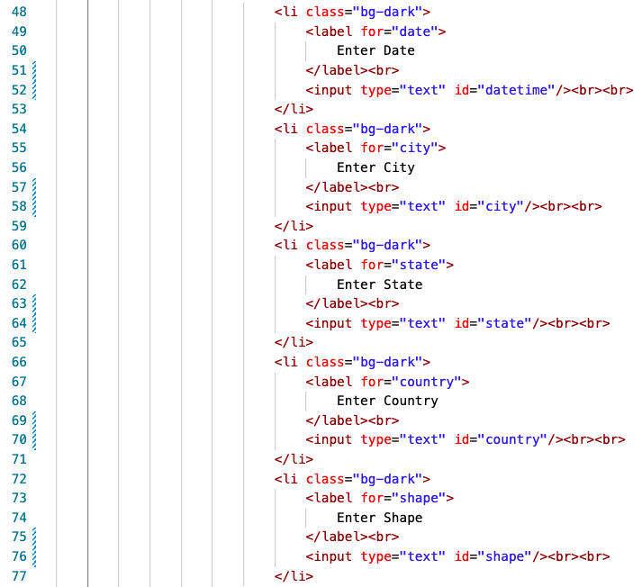
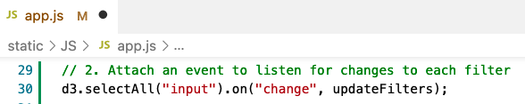
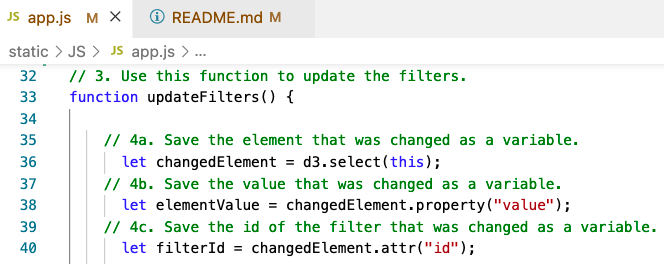
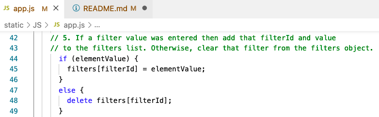
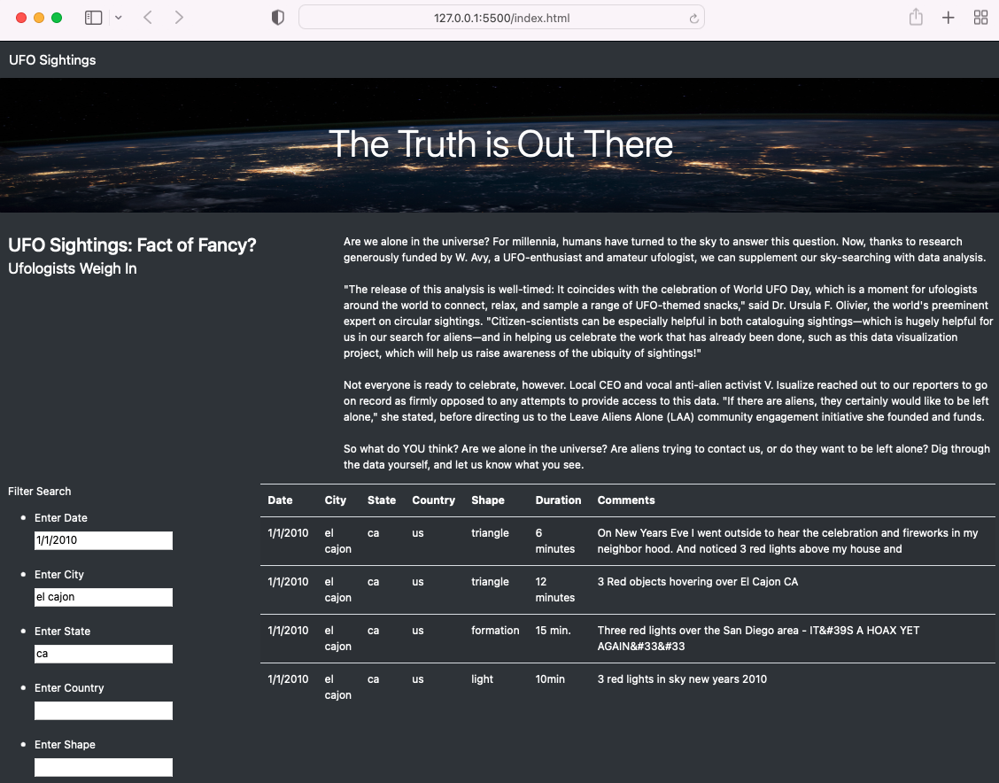

# UFOs - Module 11 Challenge

## Deliverable 1

The list element that creates the button is removed, instead, there are five "list elements" for filtering in the "index.html" file.

The event listener is modified to detect changes to each filter in the "app.js" file.

The "updateFilters()" function saves the element, value, and the id of the filter that was changed.

The "filterTable()" function loops through all of the filters and keeps any data that matches the filter values.

The webpage filters the table correctly based on user input. The following displays three filters:

* Date: 1/1/2010
* City: el cajon
* State: ca

## Deliverable 2: Analysis

### a) Overview

The purpose of this exercise is to have a webpage with a dynamic table to display UFOs sightings, allowing the user to filter for multiple criteria at the same time, within the website.

In addition to the date, the table can filter for:

* city
* state
* country
* shape

### b) Results

The search starts when a new value is entered (date, city, state, country or shape).

Note that after entering (typing) the new value, and hitting "enter" or moving the cursor and clicking in a new cell, the search starts: the "event" was listened.

    `d3.selectAll("input").on("change", updateFilters);`

Immediately, the "updateFilters" function is fed with this value (its "id" and "value"), and the updated table is generated.

    `buildTable(tableData);`

### c) Summary

One drawback of this webpage is that the information is limited to the available data in "data.js".

For further development, these could be implemented:

* Export the filtered table (txt, excel, word)
* Ability to change the background from dark to white, if selected